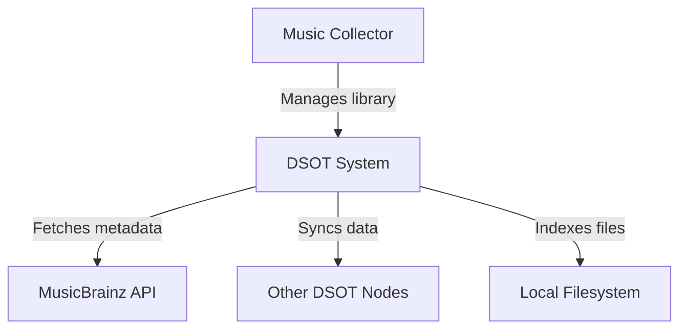

# System Context

DSOT is a local-first music management and streaming application. It allows users to manage their music libraries (physical or virtual) and synchronize metadata between devices without relying on a central server.

## Problem Statement

Music collectors often have libraries spread across multiple devices (laptops, phones, NAS). Keeping metadata (ratings, playlists, play counts) in sync while ensuring the privacy and availability of the files themselves is difficult with traditional centralized solutions.

## Personas

*   **The Music Collector:** Wants to organize a large collection of files with accurate metadata.
*   **The Multi-Device User:** Wants their library state to be consistent across all their personal devices.

## External Systems

*   **MusicBrainz:** The source of truth for music metadata (artists, albums, tracks).
*   **Iroh:** The P2P library used for device discovery and data transfer.
*   **SQLite/FTS5:** Local storage and search engine for library data.
*   **Autosurgeon/Automerge:** Tools used to manage and resolve synchronization conflicts between devices.

## System Boundary

DSOT manages indexing, metadata enrichment, and peer-to-peer synchronization. It is not a music storefront; it organizes and streams the user's existing local files.

## Context Diagram

