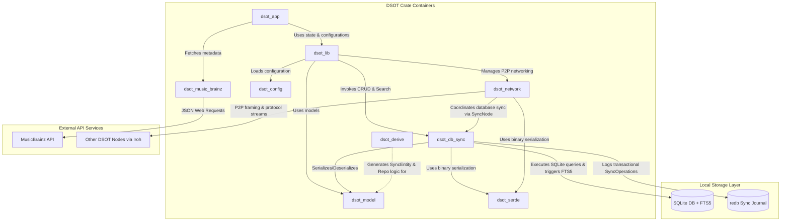

# Container Architecture

This document describes the high-level container structure of the DSOT application. In our Rust codebase, these containers are represented by crates in a single Cargo workspace, dividing responsibilities between domain modeling, database persistence & sync journaling, proc-macro generation, and API integration.

## Container Diagram

---

## Workspace Containers

### 1. `dsot_model` (Domain & Entity Definition)
*   **Responsibility:** Defines the clean domain types (like `Artist`) and shared models.
*   **Technology:** Pure Rust, `serde`.
*   **State:** Stateless representation of data.

### 2. `dsot_db_sync` (Replication Journal & Repository)
*   **Responsibility:** Provides the storage engine, transaction management, full-text search interface, sync journal, and local state reconciliation logic (via the `SyncNode` trait). Network communication is decoupled from this container.
*   **Technology:** `sqlx` (SQLite driver with FTS5 triggers), `redb` (embedded pure Rust Key-Value database), `blake3` (sync hashing), `dsot_serde`.
*   **Key Interface:** `SyncEntityRepository` trait defining standard CRUD/FTS5 search queries, and `SyncNode` trait for database state evaluation and diffing during synchronization.

### 3. `dsot_derive` (Procedural Macro Generator)
*   **Responsibility:** Reduces boilerplate by automatically generating repository structures, SQL CRUD bindings, and FTS5 search queries for any annotated struct.
*   **Technology:** `proc-macro2`, `syn`, `quote`.
*   **Key Macro:** `#[derive(SyncEntity)]` with custom attributes like `#[table(...)]`.

### 4. `dsot_music_brainz` (External Metadata Client)
*   **Responsibility:** Provides a type-safe API client to query the MusicBrainz database.
*   **Technology:** `reqwest`, `serde_json`, Lucene query-builder utilities.

### 5. `dsot_config` (Flexible Configuration Management)
*   **Responsibility:** Loads, parses, merges, and overrides multi-source, multi-layer application settings (defaults, files, custom paths, env).
*   **Technology:** `bakunin_config`, `dirs`, `thiserror`.

### 6. `dsot_lib` (Orchestration & State Management)
*   **Responsibility:** Integrates user management, logging, database connections, P2P networking, and application-wide configuration into a unified state container (`DsotState`).
*   **Technology:** `dsot_db_sync`, `dsot_network`, `dsot_config`, `dsot_model`, `sysdirs`, `fern`.

### 7. `dsot_app` (Multi-Platform Client Interface)
*   **Responsibility:** Renders the Dioxus-based user interface for managing libraries and syncing metadata. Runs natively on both desktop and mobile layouts.
*   **Technology:** `dioxus`, `dsot_lib`.

### 8. `dsot_network` (P2P Networking & Protocol Transport)
*   **Responsibility:** Manages Iroh peer-to-peer networking nodes, connection framing (`NetworkChannel`), device discovery, address book, and protocol transport. It implements the network transport layer for database synchronization (`DBSyncProtocol`, `NetworkDBSyncNode`), cleanly decoupling network communication from database sync logic.
*   **Technology:** `iroh`, `tokio`, `futures-util`, `dsot_db_sync`, `dsot_serde`.

### 9. `dsot_serde` (Binary Serialization Utilities)
*   **Responsibility:** Provides lightweight, standardized MessagePack binary serialization and deserialization utilities (`BinarySerde`, `serde_binary!` macro) used across domain entities, network framing, and sync messages.
*   **Technology:** `rmp-serde`, `serde`.
