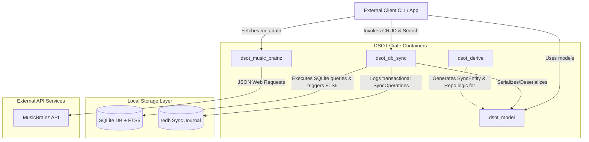

# Container Architecture

This document describes the high-level container structure of the DSOT application. In our Rust codebase, these containers are represented by crates in a single Cargo workspace, dividing responsibilities between domain modeling, database persistence & sync journaling, proc-macro generation, and API integration.

## Container Diagram

---

## Workspace Containers

### 1. `dsot_model` (Domain & Entity Definition)
*   **Responsibility:** Defines the clean domain types (like `Artist`) and shared models.
*   **Technology:** Pure Rust, `serde`.
*   **State:** Stateless representation of data.

### 2. `dsot_db_sync` (Replication Journal & Repository)
*   **Responsibility:** Provides the storage engine, transaction management, full-text search interface, and sync journal.
*   **Technology:** `sqlx` (SQLite driver with FTS5 triggers), `redb` (embedded pure Rust Key-Value database), `blake3` (sync hashing).
*   **Key Interface:** `SyncEntityRepository` trait defining standard CRUD and FTS5 search queries.

### 3. `dsot_derive` (Procedural Macro Generator)
*   **Responsibility:** Reduces boilerplate by automatically generating repository structures, SQL CRUD bindings, and FTS5 search queries for any annotated struct.
*   **Technology:** `proc-macro2`, `syn`, `quote`.
*   **Key Macro:** `#[derive(SyncEntity)]` with custom attributes like `#[table(...)]`.

### 4. `dsot_music_brainz` (External Metadata Client)
*   **Responsibility:** Provides a type-safe API client to query the MusicBrainz database.
*   **Technology:** `reqwest`, `serde_json`, Lucene query-builder utilities.
