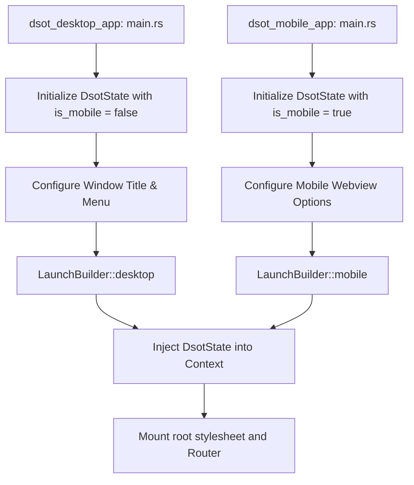

# Multi-Platform UI Client (`dsot_desktop_app`, `dsot_mobile_app`, & `dsot_shared_ui`)

The UI layer is split into distinct projects located under `src/app/` to ensure clear separation of concerns, native bundling config per platform, and a shared presentation library:

- **`dsot_desktop_app`**: Native desktop executable targeting desktop platforms (GTK/WebView via muda/tao).
- **`dsot_mobile_app`**: Native mobile executable targeting mobile webviews.
- **`dsot_shared_ui`**: Shared presentation library containing views, widgets, and shared assets (fonts, favicon, root stylesheet) used by both platforms.

---

## Crate Layout & Key Components

```
src/app/
├── desktop/           # dsot_desktop_app (Executable Crate)
│   ├── assets/        # Desktop-specific styling overrides & icons
│   └── src/
│       ├── main.rs    # Desktop application entrypoint & window configuration
│       ├── layout.rs  # Desktop page layout structure with footer/topbar panels
│       ├── routes.rs  # Desktop-specific router mapping
│       └── widgets/   # Desktop-only layout panels (frame, topbar, footer, left/right panels)
│
├── mobile/            # dsot_mobile_app (Executable Crate)
│   ├── assets/        # Mobile-specific icons
│   └── src/
│       ├── main.rs    # Mobile application entrypoint & initialization
│       ├── layout.rs  # Mobile navigation/header layout
│       └── routes.rs  # Mobile-specific router mapping
│
└── shared_ui/         # dsot_shared_ui (Library Crate)
    ├── assets/        # Shared resources (Satoshi/Tanker fonts, root.css, favicon, logo)
    └── src/
        ├── lib.rs     # Library exports (assets, views, widgets)
        ├── assets.rs  # Shared asset mappings with `asset!` macro
        ├── views/     # Route pages (HomeView, ConfigView, InboxView)
        └── widgets/   # Reusable widgets (InboxAdd, InboxList)
```

---

## Core Initialization Lifecycle

Each platform runs its own entrypoint binary. The application state context is bound at startup using their respective `main.rs`:



### Context Injection
Upon launching, the client application injects the shared `DsotState` (from [dsot_lib](file:///projects/dsot/docs/architecture/L3-components/lib.md)) using Dioxus context injection (`LaunchBuilder::with_context`). This allows any down-tree widget or view in `dsot_shared_ui` to retrieve the database pool or configuration using:
```rust
let state = use_context::<DsotState>();
```

---

## Views & Widgets (`dsot_shared_ui`)

### 1. Views (`views/`)
- **`HomeView`**: The dashboard containing library summaries, play queues, and navigation links.
- **`ConfigView`**: Interacts with `dsot_config` to view logs, custom database paths, and active profile information.
- **`InboxView`**: Displays items captured by the user that need matching. Connects to `InboxItemRepository` to list unmatched items.

### 2. Widgets (`widgets/`)
- **`inbox_add`**: A form rendering inputs to capture new files, artists, or notes. Validates inputs and inserts a serialized `InboxItem` into the repository.
- **`inbox_list`**: Queries, lists, and manages the lifecycle of inbox items, allowing actions to trigger matching pipelines or delete items.

---

## Technical Details

- **UI Framework**: Dioxus v0.7.
- **Styling**: Standard Vanilla CSS loaded from `dsot_shared_ui::assets::ROOT_CSS`.
- **Assets**: Bound using compile-time Dioxus assets hooks (`asset!()`).
