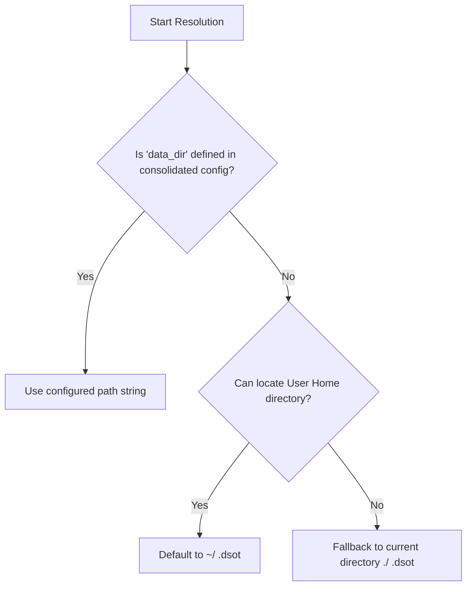

# Configuration Component (`dsot_config`)

The `dsot_config` crate is the dedicated configuration management library for the DSOT system. Because DSOT is designed to run across multiple environments and interfaces—including command-line interfaces (CLIs), background sync daemons, and desktop GUIs—it requires a flexible, multi-layered configuration strategy.

The configuration engine is built on top of the **`bakunin_config`** library, allowing DSOT to dynamically load, merge, and override configuration values from in-memory defaults, system-wide and user-local files, explicitly passed custom paths, and environment variables.

---

## Core Configuration Structures

### 1. `DsotConfig`
The consolidated configuration instance returned after resolving all configuration sources.

```rust
#[derive(Debug, Clone)]
pub struct DsotConfig<T> {
    /// Resolved absolute path to the directory where DSOT databases and local state are stored.
    pub data_dir: PathBuf,
    /// Typed configuration values loaded from the source.
    pub value: T,
    /// Evaluated and merged dynamic configuration value tree.
    pub inner: Value,
    /// The underlying configuration manager engine.
    pub handler: BakuninConfig,
}
```

### 2. `ConfigOptions`
A builder-pattern struct used to configure how configuration values are sourced and merged at runtime.

```rust
#[derive(Debug, Clone, Default)]
pub struct ConfigOptions {
    /// If true, creates a global configuration file with base defaults if it does not already exist.
    pub create: bool,
    /// If true, automatically scans home, system config, and local directories for config files.
    pub search: bool,
    /// If true, looks up environment variables prefixed with "DSOT_" to override values.
    pub use_env: bool,
    /// An optional, explicit path to a custom configuration file (takes precedence over search matches).
    pub config_path: Option<String>,
    /// If true, reads global configuration directly from the data directory (ignoring search options).
    pub from_data_dir: bool,
}
```

`ConfigOptions` provides a fluent API for quick initialization:
*   `ConfigOptions::new()`: Initializes default options.
*   `.create_if_missing()`: Enables auto-creation of global configuration files.
*   `.auto_detect()`: Enables search and discovery across standard file locations.
*   `.use_env()`: Configures the loader to read env overrides.
*   `.with_config_path(path)`: Specifies a manual target configuration path.
*   `.from_data_dir()`: Configures the loader to read from data_dir.

---

## Layer Priority & Precedence

When `DsotConfig::load(options, base_value)` is called, the loader builds a multi-tiered environment where layers are evaluated from lowest to highest priority. Values in higher layers override identical keys defined in lower layers:

| Priority | Layer Name | Sourcing Strategy | Description |
| :--- | :--- | :--- | :--- |
| **1 (Lowest)** | `"base"` | Memory Layer | In-memory defaults passed in by the client interface via `base_value`. |
| **2** | `"global"` | File Layer | Scanning user directories for `.dsot` configuration files. |
| **3** | `"local"` | File Layer | Scanning the current working directory for local `.dsot` files. |
| **4** | `"custom"` | File Layer | Loaded from an explicitly specified `config_path` if provided. |
| **5 (Highest)**| `"env"` | Environment Layer | System environment variables starting with the prefix `DSOT_`. |

### Config File Formats
Files matching the base name `.dsot` are resolved by `bakunin_config::file_finder::FileFinder` with standard configuration format extensions (such as `.json`, `.toml`, or `.yaml` depending on environment capabilities).

---

## Data Location Resolution Strategy

A core invariant of the local-first design is locating the local repository (SQLite database, FTS5 indices, and synchronization logs). The `data_dir` directory is determined dynamically using the consolidated configuration value tree via a robust fallback ladder:



1.  **Configured Location:** If the consolidated configuration contains a string value for `"data_folder"`, it is parsed and used as the absolute directory.
2.  **Home Directory Fallback:** If `"data_folder"` is missing or invalid, the system attempts to resolve the standard user home directory (using the `dirs` crate) and defaults to `~/.dsot`.
3.  **Current Directory Fallback:** If the home directory cannot be resolved, the system defaults to `./.dsot` relative to the current working directory.

---

## Error Handling

All configuration errors are typed under `DsotConfigError`, mapping external configuration issues safely:

```rust
#[derive(Debug, Error)]
pub enum DsotConfigError {
    #[error("Config Error: {0}")]
    BakuninError(#[from] BakuninError),
}
```

The crate exposes a custom `Result<T>` type alias `pub type Result<T> = std::result::Result<T, DsotConfigError>` for standardized error handling across config loading routines.
