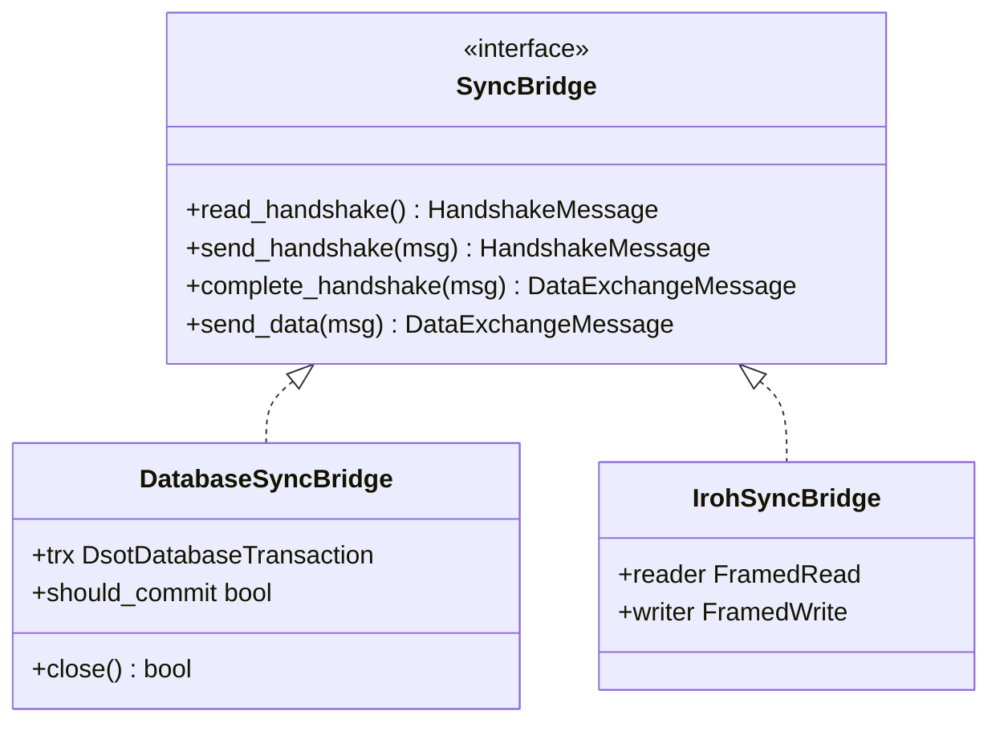

# Sync & Database Component (`dsot_db_sync`)

The `dsot_db_sync` crate implements SQLite storage (`sqlx`) and a transactional operation-log synchronization engine backed by an embedded key/value store (`redb`). It provides:

- The runtime database handle (`DsotDatabase`) and its transactional view (`DsotDatabaseTransaction`).
- The contract every domain entity satisfies (`SyncEntity`, `SyncEntityRepository`) plus the diff/serialization machinery (`UpdateValue`, `EntityMessagePack`).
- The journal log and the primitives needed to compare and exchange journals between nodes.
- A `DatabaseManager` that opens an on-disk database folder, applies migrations, and manages backups.

The crate doesn't define any concrete entities — each entity lives in `dsot_model` and uses the `#[derive(SyncEntity)]` macro (in `dsot_derive`) to generate its `Sql` row struct + repository against this crate's contracts.

---

## Crate layout

```
src/modules/db_sync/src/
├── database/         # DsotDatabase + transactions + journal + per-entity ops
├── manager/          # On-disk folder lifecycle: open, migrate, backup/restore
├── model/            # SyncOperation, JournalEntry, UpdateValue, IntoUpdateValue
├── sync/             # Database synchronization protocol & message types (V1)
│   ├── mod.rs        # Re-exports V1 sync interfaces
│   └── v1/
│       ├── db_sync_bridge.rs  # DatabaseSyncBridge wrapping database transitions
│       ├── handler.rs         # SyncBridge trait + SyncHandler execution loop
│       ├── iroh_protocol.rs   # DBSyncProtocol implementing Iroh's ProtocolHandler
│       ├── iroh_sync_bridge.rs # IrohSyncBridge wrapping Iroh endpoints/streams
│       └── model.rs           # Handshake, DataExchange, and SyncMessage models
├── dser.rs           # EntityMessagePack — rmp-serde wrapper
├── entity.rs         # SyncEntity, IntoSyncEntity traits
├── error.rs          # DBSyncError — central error enum for the crate
├── registry.rs       # Distributed-slice registry of per-table apply functions
└── repo.rs           # SyncEntityRepository trait + ListQuery + RepositoryError (alias)
```

---

## Entity contract

### `SyncEntity` (`entity.rs`)

The macro implements this on every `*Sql` row struct. It produces the four mutation operations the journal carries:

```rust
pub trait SyncEntity {
    type Entity;

    fn get_id(&self) -> Uuid;
    fn op_create(&self) -> dser::Result<SyncOperation>;
    fn op_update(&self, prev: &Self::Entity) -> Option<SyncOperation>;
    fn op_delete(&self) -> SyncOperation;
    fn op_restore(&self) -> SyncOperation;
    fn from_bytes(data: &[u8]) -> dser::Result<Self::Entity>;
    fn to_bytes(&self) -> dser::Result<Vec<u8>>;
}
```

`op_update` returns `None` when nothing actually changed; otherwise it walks each non-id, non-metadata field and emits an `UpdateColumnOp` for each diff via `UpdateValue::get_if_diff` — plus a synthetic `updated = now()` column so the row's audit timestamp always advances.

`IntoSyncEntity` (also in `entity.rs`) converts the user-facing struct (e.g. `Artist`) into its persisted form (e.g. `ArtistSql`) — `Sql` rows carry the framework-managed `created` / `updated` / `deleted` columns that the user-facing struct doesn't.

### `SyncEntityRepository` (`repo.rs`)

```rust
pub trait SyncEntityRepository {
    type RepoEntity: SyncEntity<Entity = Self::RepoEntity>;

    fn get_table_name() -> &'static str;

    async fn insert(executor: &mut SqliteConnection, entity: &Self::RepoEntity) -> Result<()>;
    async fn get(executor: &mut SqliteConnection, id: Uuid) -> Result<Self::RepoEntity>;
    async fn try_get(executor: &mut SqliteConnection, id: Uuid) -> Result<Option<Self::RepoEntity>>;
    async fn list(executor: &mut SqliteConnection, q: ListQuery) -> Result<Vec<Self::RepoEntity>>;
    async fn update(executor: &mut SqliteConnection, id: Uuid, updates: Vec<UpdateColumnOp>) -> Result<()>;
    async fn delete(executor: &mut SqliteConnection, id: Uuid) -> Result<()>;
    async fn restore(executor: &mut SqliteConnection, id: Uuid) -> Result<()>;
    async fn search(executor: &mut SqliteConnection, query: String) -> Result<Vec<Self::RepoEntity>>;
    async fn exec_op(executor: &mut SqliteConnection, op: SyncOperation) -> Result<()>;
}
```

The macro implementation reads the `#[table(name)]` attribute on the source struct and emits compile-time-checked `sqlx::query!` / `sqlx::query_as!` calls — meaning the schema in `migrations/` must exist before the entity will compile.

`exec_op` dispatches a `SyncOperation` to the right concrete method (`Create` → `insert`, `Update` → `update`, `Delete` → `delete`, `Restore` → `restore`) and is the routine the journal replay uses.

`RepositoryError` is a type alias pointing to `DBSyncError`, which covers `EntityNotFound`, `DatabaseError` (sqlx), and `SerializationError` (msgpack).

---

## The journal

### `SyncOperation` (`model/mod.rs`)

```rust
pub enum SyncOperation {
    Create(Vec<u8>),                    // full row, msgpack-encoded
    Update(Uuid, Vec<UpdateColumnOp>),  // column-level diff
    Delete(Uuid),                       // soft-delete (sets deleted = 1)
    Restore(Uuid),                      // unsets the deleted flag
}

pub struct UpdateColumnOp {
    pub column: String,
    pub value: UpdateValue,
}
```

`Create` carries the entire encoded row; the id is embedded in the msgpack payload, not duplicated as an outer field.

### `UpdateValue` + `IntoUpdateValue` (`model/update_value.rs`)

`UpdateValue` is the SQLite-native value variant used by `Update` ops:

```rust
pub enum UpdateValue { Null, Integer(i64), Real(f64), Text(String), Blob(Vec<u8>) }
```

`IntoUpdateValue` is implemented for every Rust type that may appear on a `SyncEntity` field, plus an `Option<T>` blanket-impl mapping `None` to `Null`. Supported as of writing: `String`, `i64`, `u32`, `u64`, `f64`, `bool`, `chrono::DateTime<Utc>`, `chrono::NaiveDate`, `uuid::Uuid`, `Vec<u8>`, `sqlx::types::Json<Vec<String>>`. Any custom field type (e.g. the `ReleaseGroupType` enum in `dsot_model`) must provide its own `IntoUpdateValue` impl alongside its `sqlx::Encode<Sqlite>` / `sqlx::Decode<Sqlite>` impls.

### `EntityMessagePack` (`dser.rs`)

Thin wrapper over `rmp-serde` used for *all* on-wire and on-disk serialization in this crate (the entity row inside `Create`, the full `JournalEntry`, opaque payloads in any entity that carries `Vec<u8>`). Centralizing the format here means the choice of msgpack is changeable in one place.

### `JournalEntry` (`model/mod.rs`)

```rust
pub struct JournalEntry {
    pub id: Uuid,       // primary key in the redb journal table
    pub table: String,  // routes the op to a RepositoryRegistry entry
    pub op: SyncOperation,
}
```

### `redb` journal storage (`database/journal.rs`)

A single redb table, `JOURNAL_TABLE`, keyed by the journal entry's `Uuid` (`[u8; 16]`) and storing the msgpack-encoded `JournalEntry`. Every mutation that goes through `DsotDatabase` or `DsotDatabaseTransaction` writes a journal entry inside the same transaction as the SQL change, so the journal and SQL never drift.

---

## Synchronization

DSOT is local-first: each device owns a full SQLite database and a full journal. Devices reconcile by exchanging *journal entries*, not row snapshots, so a per-column edit on one device round-trips as a per-column edit on another.

### Protocol Engine (`sync/v1/`)

The crate implements a complete synchronization protocol engine using the Iroh network protocol under the ALPN `b"/dsot/db_sync/1"`. It coordinates state reconciliation between nodes using a modular bridge design built around the `SyncBridge` trait.

#### Core Message Types (`sync/v1/model.rs`)

*   **`SyncMessage<T>`**: Outermost message wrapper. Can be `InProgress(T)`, `Complete`, or `Error(Option<String>)`.
*   **`HandshakeMessage`** / **`Handshake`**: Message sent during initial session establishment:
    *   `Hello(String)`: Sent by the initiating node containing its database identifier.
    *   `Ack(SyncHash)`: Acknowledgment containing the node's current state hash (a `BLAKE3` digest over its sorted journal keys).
*   **`DataExchangeMessage`** / **`DataExchange`**: Exchanged to reconcile different states:
    *   `Begin(Vec<SyncKey>)`: Initiates key exchange with a list of all journal keys (`[u8; 16]`) present locally.
    *   `Trade { keys, request, entries }`: The key exchange workhorse. Contains the sender's current journal keys, the keys requested from the remote node (`request`), and the serialized journal entries (`Vec<u8>`) requested by the remote node in the previous step.
    *   `Validate(SyncHash)`: Sent when a node believes it is fully synchronized, prompting the receiver to verify hashes.

#### Modular Bridge Architecture

The sync subsystem decouples network transport from the database state transitions:



*   **`SyncBridge`**: The trait defining the protocol operations.
*   **`DatabaseSyncBridge`**: Wraps a local `DsotDatabase` and a transaction. Implements `SyncBridge` to compute state hashes, evaluate differences, apply remote journal entries, and retrieve requested entries from storage.
*   **`IrohSyncBridge`**: Wraps an `iroh::endpoint::Connection`. Implements `SyncBridge` to send and receive framed MessagePack payloads over the network.
*   **`SyncHandler`**: Coordinates the protocol execution between any two implementations of `SyncBridge` via the `SyncHandler::sync` function:
    ```rust
    pub async fn sync<SA: SyncBridge, SB: SyncBridge>(a: &mut SA, b: &mut SB) -> Result<()>
    ```
*   **`DBSyncProtocol`**: Implements Iroh's `ProtocolHandler`. When a connection is accepted, it instantiates both an `IrohSyncBridge` (remote) and a `DatabaseSyncBridge` (local), runs `SyncHandler::sync` to reconcile them, and calls `local_bridge.close()` at the end to commit or rollback the transaction based on success or error.

#### Reconciliation Protocol Flow

When two nodes reconcile via `SyncHandler::sync`, the following flow occurs:

1.  **State Handshake:** The initiating node sends `Handshake::Hello(db_id)`. The receiver validates the ID and responds with `Handshake::Ack(hash_B)`. If the hash matches the initiating node's local hash, both databases are already in sync and the session completes.
2.  **Key Exchange Start:** If hashes mismatch, the initiator sends `DataExchange::Begin(keys_A)`.
3.  **Exchange Trade:** The receiver compares `keys_A` with its local keys, computes the set difference of keys it is missing, and replies with `DataExchange::Trade` containing its own `keys_B`, the list of requested keys, and any entries the remote is missing.
4.  **Symmetric Merging:** The initiator receives the `Trade` message, applies the incoming entries in a single transaction via `RepositoryRegistry::instance().apply()`, computes the keys it is missing, fetches the journal entries requested by the remote, and sends another `Trade` message.
5.  **Final Validation:** Once no missing entries or keys are left to request, the nodes send `DataExchange::Validate(hash)` to confirm their state hashes match. Upon successful validation, both nodes transition to `Complete`.

### Status

The synchronization state comparison, key exchange, payload exchange, and transaction replay primitives are fully implemented and verified via unit/integration tests in `sync_entity_contract.rs` and the `sync_database` example.

The external **transport coordinator** — the discovery layer, connection management, and transport protocol (e.g. over Iroh, WebSockets, or libp2p) that handles the networking socket calls to drive these protocol methods — is implemented externally to this crate.

### `RepositoryRegistry` (`registry.rs`)

Journal replay needs to find the right `SyncEntityRepository` impl for an arbitrary table name read out of a `JournalEntry`. The macro-generated code emits, per entity, a `static` entry into a `linkme::distributed_slice` named `APPLY_SQL_OPERATION_REF`:

```rust
pub struct ApplySqlOperationRef {
    pub table: &'static str,
    pub apply: ApplySqlOperation,  // fn(&mut Trx, SyncOperation) -> BoxFuture<Result<()>>
}

#[linkme::distributed_slice]
pub static APPLY_SQL_OPERATION_REF: [ApplySqlOperationRef];
```

`RepositoryRegistry::instance()` lazily builds a `HashMap<table_name, apply_fn>` from this slice at first use. **Consequence:** entities not linked into a given binary won't appear in the registry — handy for test binaries that intentionally include only a subset, but a footgun if you forget to depend on `dsot_model` from a binary that must replay all journals. `apply_journals_bytes` errors out with `RepositoryNotFound(table)` if it ever encounters a table no one registered for.

### Apply semantics

`safe_apply_op` (`database/entity_ops.rs`) is the routine every journal-driven write goes through. Its one nontrivial behavior: for a `Create`, it first checks whether the entity id already exists and **skips** the insert if so, instead of erroring on a duplicate-key violation. This is how the system stays idempotent under journal replay — applying the same journal twice is a no-op.

---

## Full-text search (FTS5)

For each searchable relational table, a parallel FTS5 virtual table holds the row's searchable columns. The FTS table is **populated by SQL triggers**, not by application code — so an `INSERT` / `UPDATE` / `DELETE` against the base table is automatically reflected in FTS within the same SQL statement.

Example (`migrations/20260518161623_artists.sql`):

```sql
CREATE VIRTUAL TABLE artists_fts USING fts5(
    id UNINDEXED,
    name,
    sort_name,
    aliases
);

CREATE TRIGGER artists_after_insert AFTER INSERT ON artists BEGIN
    INSERT INTO artists_fts(id, name, sort_name, aliases)
    VALUES (
        new.id, new.name, new.sort_name,
        (SELECT group_concat(value, ' ') FROM json_each(new.aliases))
    );
END;

CREATE TRIGGER artists_after_delete AFTER DELETE ON artists BEGIN
    DELETE FROM artists_fts WHERE id = old.id;
END;

CREATE TRIGGER artists_after_update AFTER UPDATE ON artists BEGIN
    DELETE FROM artists_fts WHERE id = old.id;
    INSERT INTO artists_fts(id, name, sort_name, aliases)
    VALUES (new.id, new.name, new.sort_name,
            (SELECT group_concat(value, ' ') FROM json_each(new.aliases)));
END;
```

Note the **DELETE + INSERT** pattern in the UPDATE trigger — the FTS5-recommended approach when an update touches indexed columns (cheaper and more robust than per-column updates on the virtual table). The `group_concat` over `json_each` flattens a `Json<Vec<String>>` column into space-separated tokens before indexing.

The macro-generated `search()` query joins the base table against `<table>_fts` on `id`, filters `MATCH ?` plus `deleted = 0`, and orders by `f.rank`. Soft-deleted rows stay in the FTS index (the after-delete trigger only fires on actual SQL `DELETE`, not on the `deleted = 1` flag flip) but the `WHERE` clause hides them from results.

Entities with no natural text to index still need an FTS table to exist for the generated `search()` query to compile — see `migrations/20260526143855_track_file.sql` for the minimal bare-FTS-table-without-triggers pattern.

---

## Runtime entry points

### `DsotDatabase` (`database/mod.rs`)

The runtime handle. Wraps a `redb::Database` (journal) and a `sqlx::SqlitePool` (SQL).
*   **Identity:** Carries an `id: String` representing the database identity. Can be customized on creation using `.with_id(id)` and retrieved using `.get_id()`.
*   **Convenience APIs:** Exposes per-entity methods that begin a transaction, apply + journal one operation, and commit atomically: `insert`, `update`, `upsert`, `delete`, `restore`, and `apply_journal`.
*   **Read-Only APIs:** Exposes connection pool accessors for read actions: `get`, `try_get`, `list`, and FTS5 `search`.

### `DsotDatabaseTransaction` (`database/transaction.rs`)

Returned from `DsotDatabase::begin_transaction()` when multiple operations must commit or roll back atomically. Holds a `redb::WriteTransaction` and a `sqlx::Transaction<Sqlite>` in lockstep. It provides the same per-entity mutation methods as `DsotDatabase` (minus the auto-committing behavior). The transaction must be finalized by calling `commit().await` or `rollback().await`.

### `DatabaseManager` (`manager/`)

A lightweight entry point that owns and manages a physical database directory on disk:

*   `open_folder(path)`: Ensures the directory exists and validates that it is a directory.
*   `open_database()`: Connects to `<dir>/library.sqlite`, runs the embedded `sqlx` migrations (`sqlx::migrate!("../../../migrations")`), opens the transactional key/value journal `<dir>/library.journal` using `redb`, and returns an initialized `DsotDatabase`.
*   `create_backup()`: Safely copies the live `.sqlite` and `.journal` files into `<dir>/backups/` with a `<name>__<uuid>` (UUID v7) suffix.
*   `get_backups()`: Scans the backups directory, verifying both `.sqlite` and `.journal` backup files exist (`is_valid()`), and returns a list of available `DatabaseBackup` items.
*   `DatabaseBackup::restore()`: Overwrites the active active database and journal files with the backup files.

Used by application code as the single "open the database" call site.

## Errors

- `DBSyncError` (`src/modules/db_sync/src/error.rs`) — the single, consolidated error enum for the crate. It represents the union of all errors that can occur within database synchronization and management, including:
  - `redb` storage, transaction, commit, table, and database errors.
  - `sqlx` / SQLite errors.
  - Serialization / Deserialization (`rmp_serde`) errors.
  - Standard IO errors.
  - SQLx migration errors.
  - Entity-specific errors (e.g. `EntityNotFound`, `TableMissmatchError`, `RepositoryNotFound`).
  - Sync-specific errors (`SyncError`, `PathIsNotAFolder`).
