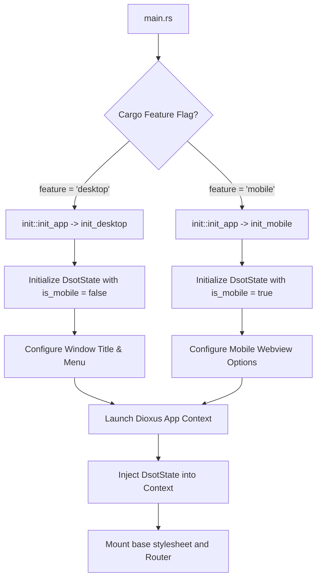

# Multi-Platform UI Client (`dsot_desktop`)

The `dsot_desktop` crate implements the graphical client interface for DSOT. Developed using the **Dioxus** framework, it provides a fast, native user interface that targets desktop (GTK Webview) and mobile webviews from a single codebase.

---

## Responsibility

- **Platform Bootstrapping:** Binds the application state context and sets up platform-specific launching options.
- **Routing & Views:** Coordinates application navigation and renders views for the library dashboard, settings, and media inbox.
- **Interactive Widgets:** Provides components for quick data capture (capturing new local files or artist metadata hints) and displaying status lists.
- **Theme & Style Application:** Loads unified styling overrides and static assets (CSS, icons) into the webview shell.

---

## Crate Layout & Key Components

```
src/desktop/src/
├── init/             # Platform-specific launch hooks (desktop.rs, mobile.rs)
├── views/            # High-level route pages (home, config, inbox)
├── widgets/          # Reusable UI components (inbox_add, inbox_list)
├── layout.rs         # Shell wrapping view elements with menus / sidebars
├── routes.rs         # Strongly typed Dioxus router declaration
└── main.rs           # Entry point delegating execution to init modules
```

---

## Core Initialization Lifecycle

The application entry point resolves platform targets at compile-time using cargo features:



### Context Injection
Upon launching, the desktop application injects the shared `DsotState` (from [dsot_lib](file:///projects/dsot/docs/architecture/L3-components/lib.md)) using Dioxus context injection (`LaunchBuilder::with_context`). This allows any down-tree widget or view to retrieve the database pool or configuration using:
```rust
let state = use_context::<DsotState>();
```

---

## Views & Widgets

### 1. Views (`views/`)
- **`HomeView`:** The dashboard containing library summaries, play queues, and navigation links.
- **`ConfigView`:** Interacts with `dsot_config` to view logs, custom database paths, and active profile information.
- **`InboxView`:** Displays items captured by the user that need matching. Connects to `InboxItemRepository` to list unmatched items.

### 2. Widgets (`widgets/`)
- **`inbox_add`:** A form rendering inputs to capture new files, artists, or notes. Validates inputs and inserts a serialized `InboxItem` into the repository.
- **`inbox_list`:** Queries, lists, and manages the lifecycle of inbox items, allowing actions to trigger matching pipelines or delete items.

---

## Technical Details

- **UI Framework:** Dioxus v0.7.
- **Features:** 
  - `desktop`: Compiles window bindings and GTK window menus via `muda`.
  - `mobile`: Invokes mobile webview bindings.
- **Styling:** Standard Vanilla CSS loaded from `assets/main.css`.
- **Favicon & Assets:** Bound using compile-time Dioxus assets hooks (`asset!("/assets/favicon.ico")`).
