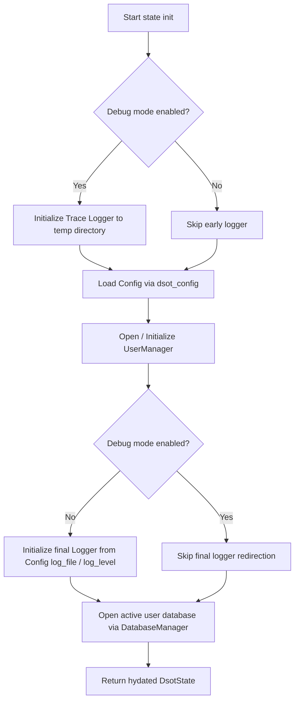

# Core Orchestration Component (`dsot_lib`)

The `dsot_lib` crate serves as the central orchestration and state management engine for the DSOT application. It aggregates configuration parsing, multi-user workspace management, logger routing, and database handles into a unified, shared state container (`DsotState`).

---

## Responsibility

- **Application State Consolidation:** Enforces a clean domain interface by packaging configuration, database handles, and user sessions.
- **Global Logger Routing:** Coordinates multi-platform logger routing (sending logs to rolling files, standard error, or temporary system directories).
- **User Profile Management:** Manages individual user directories to maintain absolute data partitioning (1 database per user).
- **Initialization Lifecycle:** Orchestrates the sequential startup chain from raw launch arguments to a fully hydrated, migrate-ready application context.

---

## Core Structures & Interfaces

### 1. `DsotState`
The primary application context shared across threads and views.

```rust
#[derive(Clone)]
pub struct DsotState {
    /// Resolved layered configuration instance.
    pub config: dsot_config::DsotConfig<configs::ConfigValue>,
    /// Manager controlling local user folders and directories.
    pub user_manager: user_manager::UserManager,
    /// Active database manager connected to the target user's database.
    pub db: dsot_db_sync::DatabaseManager,
}
```

### 2. `UserManager`
Handles discovery and lifecycle management of isolated user profiles.

```rust
#[derive(Clone)]
pub struct UserManager {
    /// Absolute path to the root 'users' directory.
    dir: PathBuf,
}
```

- `UserManager::open(root)`: Creates the user folder structure on disk if it does not already exist.
- `UserManager::list_users()`: Scans the subdirectories under `users/` and returns resolved user profile names.
- `UserManager::open_user_db(username)`: Returns an uninitialized `DatabaseManager` targeting `<root>/users/<username>/`.

### 3. `DsotStateInitOptions`
A fluent builder configuration passed to the initialization chain.

```rust
pub struct DsotStateInitOptions {
    pub debug: bool,
    pub config_file: Option<String>,
    pub is_mobile: bool,
}
```

---

## Startup Initialization Flow

When the user interface calls `DsotState::init(options)`, the library coordinates the following startup steps:



1. **Early Logging Capture:** If debug is active, it initializes a trace logger (`logger::init_log`) immediately to capture startup warnings.
2. **Layered Config Retrieval:** Sources configurations using [dsot_config](file:///projects/dsot/docs/architecture/L3-components/config.md). On mobile, it uses presets (`load_mobile_config`); on desktops, it searches standard paths (`load_config`).
3. **Workspace Preparation:** Spawns a `UserManager` pointing to the resolved `data_dir` configuration root.
4. **Final Logger Routing:** If not in debug mode, routes logger output to the paths/levels specified in the user's config file.
5. **Database Handle Binding:** Selects the target user profile and returns the active database connection handle.

---

## Technical Details

- **Logging backend:** Implemented via `fern` with structured timestamps, levels, and terminal/file output configurations.
- **System paths:** Uses the `sysdirs` crate to resolve environment-safe temporary directories across different operating systems.
- **Dependencies:** Integrates `dsot_config` for configurations, `dsot_db_sync` for storage engines, and `dsot_model` for domain representation.
