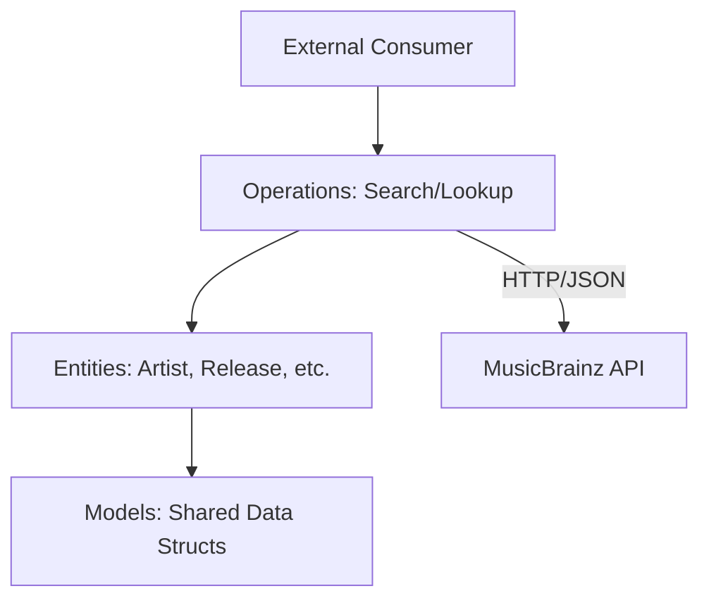

# MusicBrainz Component

The `music_brainz` crate is a Rust library designed to interact with the [MusicBrainz XML Web Service v2](https://musicbrainz.org/doc/MusicBrainz_API). It provides strongly-typed entities and operations to search and lookup musical metadata.

## Responsibility

- Provide a type-safe interface for the MusicBrainz API.
- Abstract the construction of complex search queries (using Lucene syntax).
- Manage API rate limiting and identification through User-Agent configuration.
- Handle deserialization of MusicBrainz JSON responses into local domain models.

## Key Modules

### Entities (`src/entities/`)
Defines the core MusicBrainz objects. Each entity typically supports both `Lookup` and `Search` operations through generated macros.
- **Artist:** Musicians, groups, or orchestras.
- **Release & Release Group:** Albums, singles, EPs, and their logical groupings.
- **Recording:** Unique audio tracks.
- **Work:** Compositions, lyrics, etc.
- **Area & Genre:** Geographic locations and musical styles.

### Operations (`src/operations/`)
Contains the logic for interacting with the web service.
- **Lookup:** Retrieves a single entity by its MusicBrainz ID (MBID), allowing for "inc" (includes) parameters to fetch related data in one request.
- **Search:** Performs advanced queries using the MusicBrainz search server (Lucene-based).

### Models (`src/model/`)
Shared data structures used across multiple entities, such as `Alias`, `LifeSpan`, `Tag`, and entity-specific enums like `ArtistType` or `ReleaseStatus`.

### Utils (`src/utils/`)
Internal helpers for:
- **User-Agent:** Ensuring every request identifies the client as per MusicBrainz API policy.
- **Lucene:** Helpers for building safe search queries.

## Component Diagram

## Technical Details

- **HTTP Client:** Uses `reqwest` for asynchronous requests.
- **Serialization:** Uses `serde` for JSON mapping.
- **Macros:** Heavy use of custom macros (e.g., `entity!`) to reduce boilerplate for MBID-based lookups and search field definitions.
