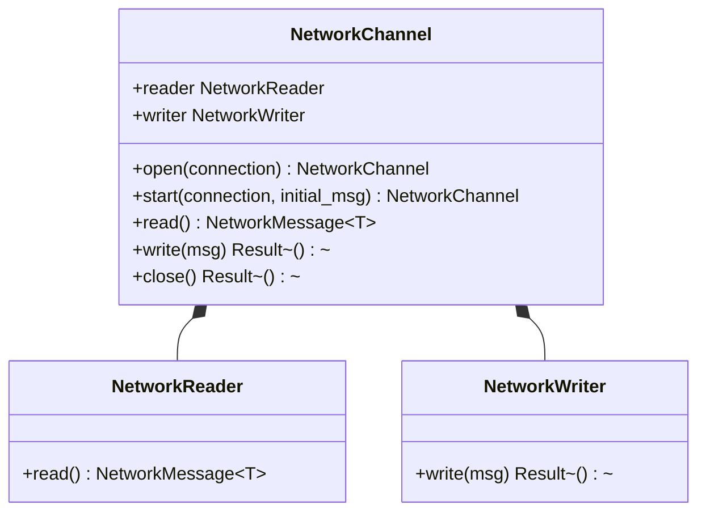
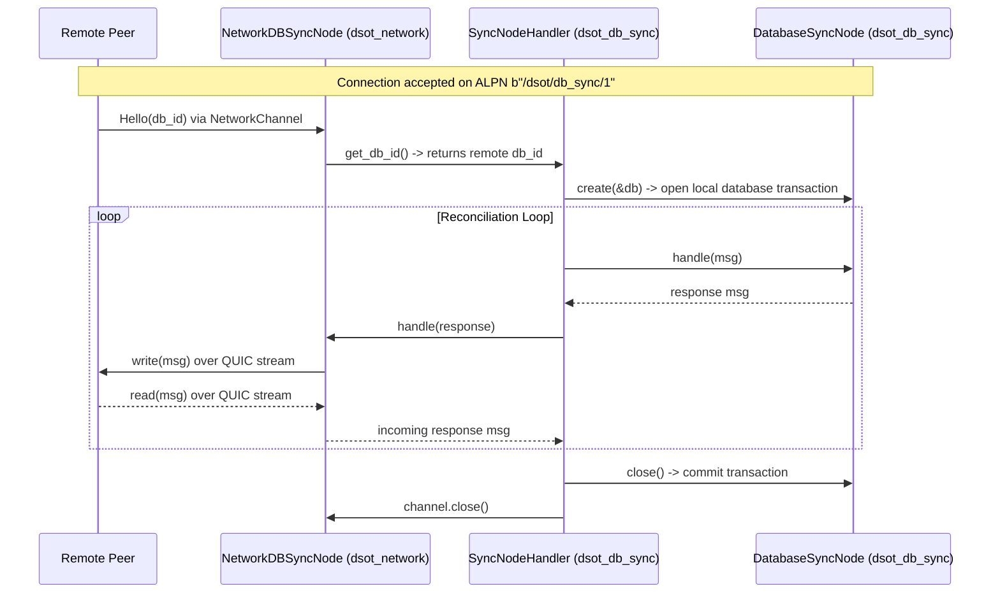

# P2P Networking & Protocol Transport Component (`dsot_network`)

The `dsot_network` crate implements the peer-to-peer (P2P) networking layer for the DSOT application using the [Iroh](https://iroh.computer/) protocol. It manages node discovery, address book persistence, connection framing, and network transport protocols—most notably providing the transport bridge for database synchronization without coupling network communication directly into database logic.

---

## Responsibility

- **P2P Node Management:** Initializes and manages an Iroh networking endpoint (`NetworkNode`), handling cryptographic identity and listening sockets.
- **Address Book & Discovery:** Maintains a persistent local record of known peer machines (`RemoteMachine`), including online/offline status tracking and endpoint identifier mapping.
- **Framed Network Channels:** Wraps raw Iroh bidirectional connection streams into structured, MessagePack-framed message channels (`NetworkChannel`).
- **Protocol Transport Decoupling:** Registers ALPN protocol handlers (e.g., `b"/dsot/db_sync/1"`) and bridges network socket streams to the database sync engine via the `SyncNode` trait.

---

## Crate Layout

```
src/modules/network/src/
├── address_book.rs    # RemoteMachine repository and persistence
├── config.rs          # NetworkConfig options (port, use_db_sync, etc.)
├── error.rs           # DsotNetworkError enum and result alias
├── init.rs            # Network initialization options & protocol builder
├── lib.rs             # Crate exports
├── machine_info.rs    # Local machine metadata and platform identification
├── node.rs            # NetworkNode wrapper around iroh::Endpoint
├── protocols/         # Protocol handlers registered with Iroh router
│   ├── db_sync/       # Database synchronization transport protocol
│   │   ├── iroh_sync_node.rs  # NetworkDBSyncNode implementing SyncNode over network
│   │   ├── mod.rs             # Module exports
│   │   └── sync_protocol.rs   # DBSyncProtocol (ALPN b"/dsot/db_sync/1")
│   ├── info.rs        # Basic node info exchange protocol
│   └── mod.rs         # Protocol registration trait
└── sink/              # Framed bidirectional message streaming
    ├── channel.rs     # NetworkChannel wrapping reader/writer pairs
    ├── message.rs     # NetworkMessage wrapper (Message, Disconnect, Error)
    ├── mod.rs         # Module exports
    ├── reader.rs      # NetworkReader (MessagePack deserialization stream)
    └── writer.rs      # NetworkWriter (MessagePack serialization stream)
```

---

## Core Architecture & Components

### 1. Framed Message Streams (`sink/`)

To reliably exchange structured Rust data types over raw QUIC streams without manual byte counting or framing errors, the crate introduces `NetworkChannel`:



- **`NetworkWriter` & `NetworkReader`**: Wrap `iroh::endpoint::SendStream` and `RecvStream` using `tokio_util::codec::LengthDelimitedCodec` and `dsot_serde::BinarySerde`. This ensures every message is prefixed with its byte length and encoded/decoded using standardized MessagePack binary serialization.
- **`NetworkMessage<T>`**: Represents stream events:
  - `Message(T)`: A successfully decoded payload.
  - `Disconnect`: Clean stream termination by the peer.
  - `Error(String)`: Transport or deserialization failure.
- **`NetworkChannel`**: Combines reader and writer into a single handle. Provides helper constructors like `open` (for incoming streams waiting to receive an initial message) and `start` (for outgoing streams initiating a session).

### 2. Decoupled Database Sync Transport (`protocols/db_sync/`)

A core architectural principle of DSOT is separating domain logic from network communication. The `dsot_db_sync` crate defines database persistence and state reconciliation logic via the abstract `SyncNode` trait, while `dsot_network` provides the concrete networking implementation:



- **`NetworkDBSyncNode`**: Wraps a `NetworkChannel` and implements `dsot_db_sync::sync::SyncNode`. When `handle(&DBSyncMessage)` is called, it serializes and transmits the message over the network channel, waits for the peer's response, and deserializes the incoming `DBSyncMessage`.
- **`DBSyncProtocol`**: Implements `iroh::protocol::ProtocolHandler` under ALPN `b"/dsot/db_sync/1"`.
  - **Incoming Connections (`accept`)**: When a remote peer connects, `DBSyncProtocol` starts a `NetworkDBSyncNode` to receive the target database ID (`Hello(db_id)`). It uses `DatabaseManagerProvider` to open the local database, initializes a local `DatabaseSyncNode`, and invokes `SyncNodeHandler::sync(&mut remote_node, &mut local_node)` to execute reconciliation.
  - **Outgoing Connections (`sync_database`)**: Connects to a remote Iroh endpoint, opens a local `DatabaseSyncNode`, starts a remote `NetworkDBSyncNode`, and runs `SyncNodeHandler::sync(&mut local_node, &mut remote_node)`.

---

## Technical Details

- **Transport Engine:** Built on `iroh` QUIC endpoints with cryptographic peer identification (`EndpointId`).
- **Asynchronous Runtime:** Powered by `tokio` and `futures-util` for concurrent stream multiplexing and non-blocking I/O.
- **Protocol Registration:** Uses an extension trait `RegisterSyncProtocolV1` on `iroh::protocol::RouterBuilder` to conditionally attach handlers based on application configuration (`NetworkInitOptions`).
